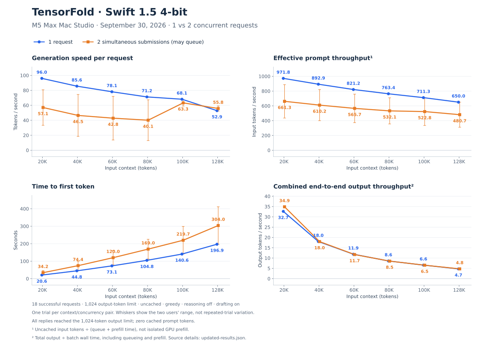
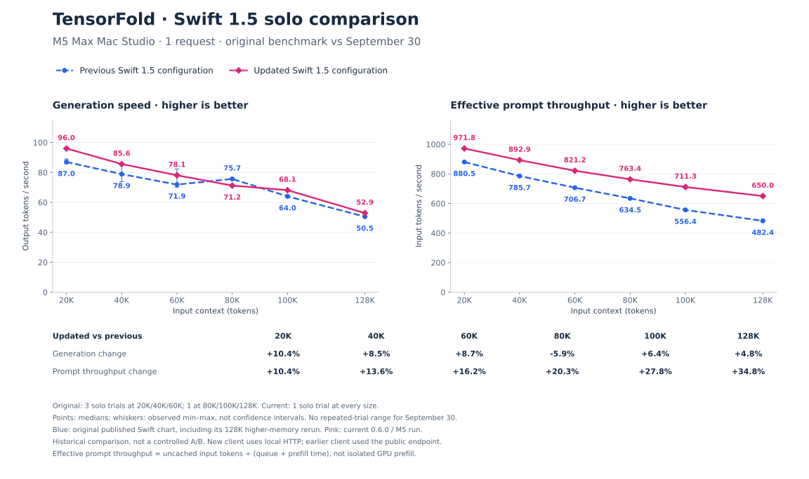
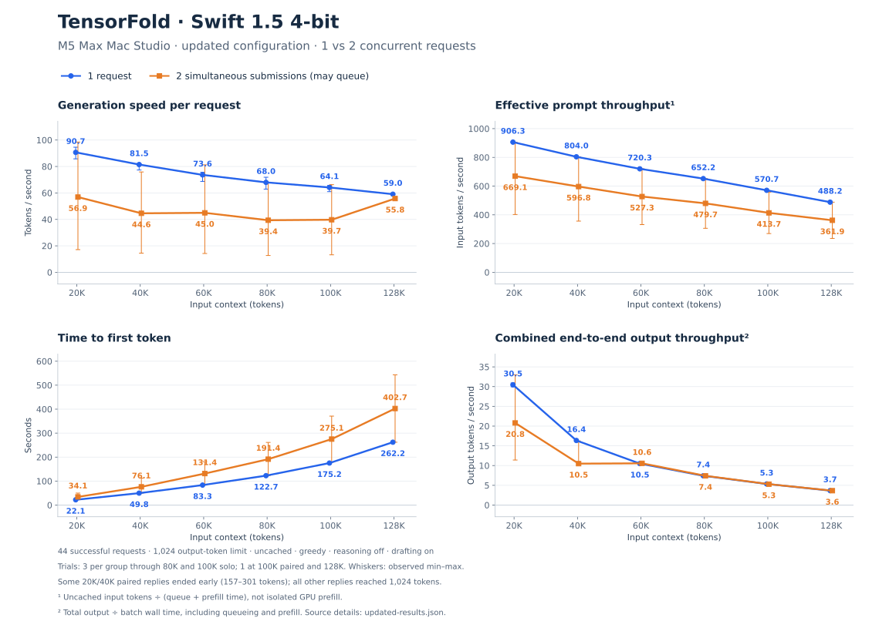
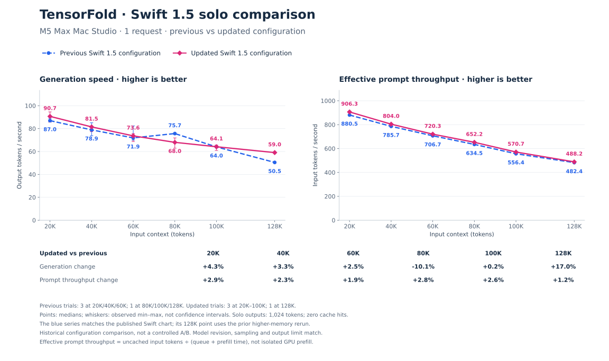
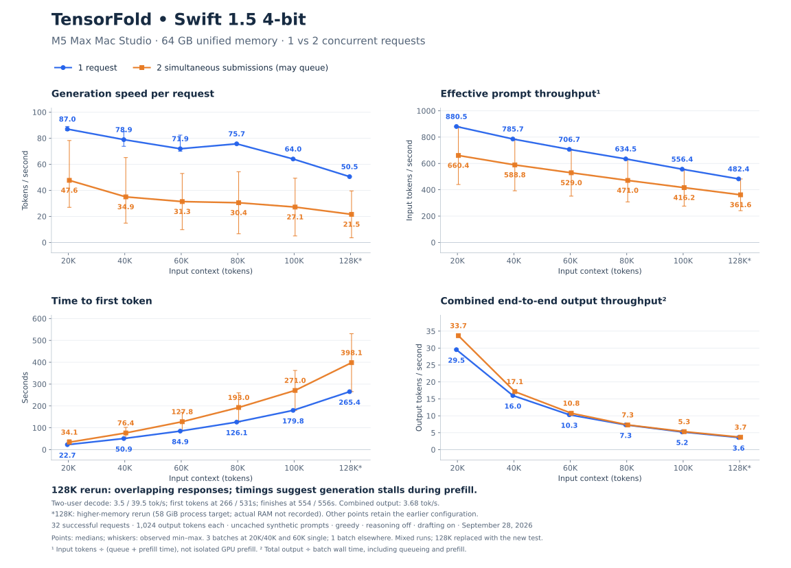
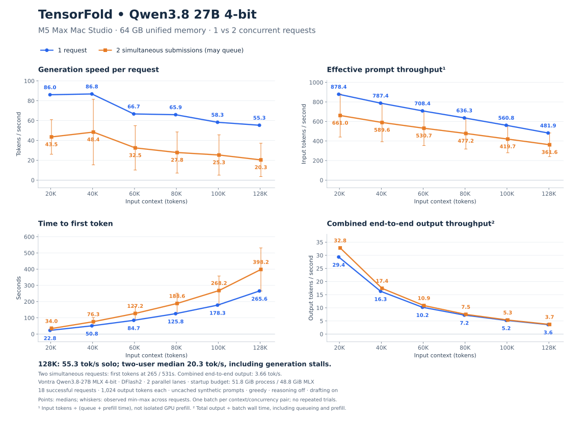

# TensorFold — Mac Studio

Our TensorFold fork for the 64 GB M5 Max Mac Studio: Swift 1.5 or Qwen3.8 27B, both MLX 4-bit with DFlash2 speculative decoding.

## Reconnect and start

SSH into the Studio, then activate the existing installation:

```bash
ssh generator@generator
cd ~/ai/tensorfold-studio
source .venv/bin/activate
```

Start **one** model:

```bash
# Swift 1.5
bash tools/start-studio.sh
```

```bash
# Or Qwen3.8 27B
bash tools/start-studio-qwen.sh
```

Both use port 8080; stop the current server before switching. Press **Ctrl+C once** and wait for shutdown to finish. The launchers enable deletion of that model's inference checkpoints in their configured cache directories on graceful shutdown. Downloaded weights stay cached. Forced termination or power loss can bypass cleanup; older cache folders are not automatically cleaned.

## Update

Stop the server, then run from the activated environment:

```bash
cd ~/ai/tensorfold-studio
git pull --ff-only
python -m pip install -e .
bash tools/start-studio.sh
# Use tools/start-studio-qwen.sh instead for Qwen.
```

## Connection and settings

| Setting | Both launchers |
| --- | --- |
| Public API base URL | `https://ai-api.ashersuter.com/v1` through the existing Cloudflare tunnel |
| Local API | `http://127.0.0.1:8080/v1` |
| Model ID | `swift-1.5` or `qwen3.8-27b` |
| API key file | `~/.config/tensorfold/api-key` |
| Context limit | 131,072 tokens, including output |
| Parallel generation | Up to 2 requests, subject to memory admission |
| History inventory | 8 histories; not a limit of 8 snapshot files |
| RAM checkpoint cache | 2 checkpoints, 8 GiB budget |
| SSD spill budget | 128 GiB per model in its configured session-cache directory |
| Drafter | `z-lab/Qwen3.8-27B-DFlash2`, enabled by default |

Swift defaults to **48 GiB process / 45 GiB MLX**, qualified with cold and cached 128K
prompts. Qwen keeps its existing 58 GiB requested process budget, subject to Metal's cap.
The observed Qwen startup cap was **51.8 GiB process / 48.8 GiB MLX**. These are budgets, not preallocated memory or a guarantee against swap. Clients do not need to enable drafting; explicitly sending `"draft": false` disables it for that request.

The launcher copies the existing llama.cpp key if the TensorFold key is missing. Never put keys in this repository. If downloads need Hugging Face authentication, run `hf auth login` in the activated environment and supply a read token interactively.

For a new installation rather than reconnecting, use Python 3.11+:

```bash
mkdir -p ~/ai
cd ~/ai
git clone https://github.com/araysuter/TensorFold.git tensorfold-studio
cd tensorfold-studio
python3 -m venv .venv
source .venv/bin/activate
python -m pip install -e .
```

Provision `~/.config/tensorfold/api-key` before launching if the old llama.cpp key is unavailable. The public hostname requires the existing tunnel; cloning this repo does not configure it.

## Benchmarks

### Long prompt processing · September 30, 2026

On the M5 Max, two cold trials per size reduced prompt time from 22.19 to 20.63 seconds
at 20K tokens, 83.81 to 73.16 seconds at 60K, and 267.33 to 197.02 seconds at 128K.
The 128K result is 26.3% less prompt time with about 99% GPU utilization. The branch
includes upstream 0.6.0 and M5 attention and DeltaNet prompt optimizations. In one
queued-request comparison, a short prompt began responding in 1.92 seconds instead
of 21.03 seconds while a long prompt was being processed.

[Measurements, runtime qualification and reproduction commands](benchmarks/studio/long-prefill/README.md).
Fused attention changes rounding; three of six greedy replies differed from the
previous path. These synthetic measurements do not establish equivalent answer quality.

[Run the benchmark suite and regenerate these charts](benchmarks/studio/README.md).

### [Swift 1.5 4-bit](https://huggingface.co/ukisai/Swift-1.5-4bit-MLX)

#### Single trial · September 30, 2026

One attempt at each 20K–128K context with one request and two simultaneous requests.
The four-panel sheet uses the same workload and layout as the earlier figures.



The solo comparison uses the original published Swift benchmark as its historical reference. Each September 30
setting has one trial; paired whiskers show variation between the two users.



[Source measurements and reproduction instructions](benchmarks/studio/charts/swift-2026-09-30/README.md).

#### Updated configuration · September 29, 2026



#### Solo speeds: previous vs updated

Blue is the previous configuration; pink is the updated configuration. Solo effective
prompt throughput increased 1.2–2.9% across these recorded runs. Generation rates
were mixed, including a 10.1% decrease at 80K and a 17.0% increase in the single
128K trial. These are historical comparisons with differing trial counts.



[Source data, sample counts and reproduction instructions](benchmarks/studio/charts/swift-2026-09-29/README.md).

#### Previous configuration



### [Qwen3.8 27B 4-bit](https://huggingface.co/Vontra/Qwen3.8-27B-MLX-4bit)



These measure synthetic uncached throughput, not coding quality. The previous Swift chart combines earlier runs with a higher-memory 128K rerun; Qwen uses one trial per configuration. They are not a controlled repeated-trial comparison. See the chart footnotes for timing definitions and sample counts.

For general model/backend documentation, see the [preserved upstream README](UPSTREAM_README.md) and [runbook](RUNBOOK.md).
